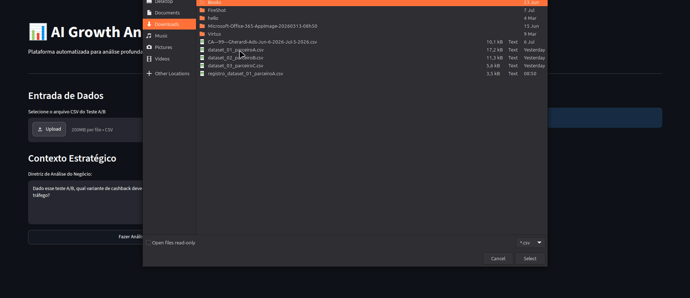

# ROIBeacon | Automação de Análises de Testes A/B

**Análise de Growth e otimização de cashback com Inteligência Artificial**



O ROIBeacon é uma aplicação para automatizar análises de testes A/B de cashback, combinando processamento de dados, inteligência artificial e integração com Google Sheets.

O objetivo deste projeto é eliminar o trabalho manual e repetitivo da equipe de Growth, processando os datasets dos testes e decidindo, de forma rápida e embasada em dados reais (ROI e Margem), qual variante deve ser escalada para 100% do tráfego.

## Como o sistema funciona?

Para resolver esse problema, construí um fluxo de trabalho (pipeline) focado em eficiência e usabilidade. Qualquer pessoa do time pode usar a ferramenta seguindo esta jornada:

1. **Upload Simples:** Uma interface limpa onde o usuário envia o arquivo `.csv` do parceiro (A, B ou C) sem precisar alterar nenhuma linha de código.
2. **Tratamento de Dados (Sanitization):** Embaixo dos panos, o sistema usa a biblioteca Pandas para limpar os dados financeiros (removendo símbolos de "R$" e ajustando as vírgulas), transformando texto em números exatos para o cálculo.
3. **Motor de Decisão (IA):** O dataset limpo é enviado ao modelo GPT-OSS 120B (`openai/gpt-oss-120b`) via Groq API. A IA atua como um analista de Growth: ela analisa as margens, o custo do cashback e o ROI e gera um relatório executivo com uma recomendação de variante.
4. **Registro Automático na Nuvem:** Ao finalizar a análise, a aplicação se conecta diretamente à API do Google Workspace e escreve o resultado em uma planilha do Google Sheets, mantendo o histórico de todos os testes organizados e centralizados de forma autônoma.

## Stack

Escolhi ferramentas modernas, fáceis de manter e muito utilizadas no mercado de dados e IA:

* **Python:** Linguagem principal do projeto.
* **Streamlit:** Escolhido para construir a interface web rapidamente, permitindo focar 100% na regra de negócio e na solução do problema.
* **Pandas:** Para manipulação, limpeza e estruturação confiável das tabelas.
* **Groq API (GPT-OSS 120B):** Executa o modelo `openai/gpt-oss-120b` para gerar as análises e recomendações. A autenticação utiliza uma chave da Groq.
* **gspread & Google Auth:** Bibliotecas para realizar a integração autônoma com o banco de dados final (Google Sheets API).

## 🔗 Recursos do Projeto

* 📊 **Planilha de Acompanhamento (Sheets):** Configurada individualmente com `GOOGLE_SHEETS_ID`, para armazenar os resultados na sua própria planilha.
* 📄 **Relatórios Individuais:** Os relatórios brutos gerados pela IA estão na pasta `/relatorios` deste repositório para conferência.

---

## Como rodar localmente

### Pré-requisitos

* Python 3.10 ou superior
* Uma chave de API da [Groq](https://console.groq.com/)
* Uma Service Account do Google Cloud, com a API do Google Sheets habilitada
* Uma planilha compartilhada com o e-mail da Service Account com permissão de edição

### 1. Clone o repositório

Copie a URL de clonagem deste repositório e substitua `<URL_DO_REPOSITORIO>` no comando abaixo:

```bash
git clone <URL_DO_REPOSITORIO> roibeacon
cd roibeacon
```

### 2. Crie e ative um ambiente virtual

```bash
python -m venv venv
source venv/bin/activate      # Linux/Mac
venv\Scripts\activate         # Windows
```

### 3. Instale as dependências

```bash
pip install -r requirements.txt
```

### 4. Configure as credenciais

Copie `.env.example` para `.env` na raiz do projeto e preencha sua chave:

```dotenv
GROQ_API_KEY=sua_chave_groq_aqui
GOOGLE_SHEETS_ID=id_da_sua_planilha
```

Para a integração com Google Sheets, crie `.streamlit/secrets.toml` e preencha os campos usando o JSON da sua Service Account:

```toml
[gcp_service_account]
type = "service_account"
project_id = "seu-projeto-id"
private_key_id = "id_da_chave"
private_key = "SUA_CHAVE_PRIVADA_DO_JSON_COM_AS_QUEBRAS_DE_LINHA"
client_email = "seu-bot@seu-projeto.iam.gserviceaccount.com"
client_id = "id_do_cliente"
token_uri = "https://oauth2.googleapis.com/token"
```

Copie o valor completo de `private_key` do JSON, preservando os escapes `\n` dentro da string TOML.

Configure `GOOGLE_SHEETS_ID` no `.env` com o ID da sua planilha de destino. O ID é o trecho entre `/d/` e `/edit` na URL do Google Sheets. Os resultados são adicionados à primeira aba, como texto, sem interpretar fórmulas.

A chave da Groq também pode ser configurada como `GROQ_API_KEY` no nível principal de `secrets.toml`, antes de `[gcp_service_account]`. O app prioriza variáveis de ambiente; o `.env` preenche variáveis que ainda não estão definidas. Se a chave não estiver no ambiente, o app consulta os Secrets do Streamlit.

Os arquivos `.env` e `.streamlit/secrets.toml` estão no `.gitignore` e não devem ser enviados ao GitHub.

### 5. Rode a aplicação

```bash
streamlit run app.py
```

A aplicação abrirá automaticamente em `http://localhost:8501`.

### 6. Use a ferramenta

1. Faça upload do CSV de um dos parceiros (A, B ou C).
2. Preencha a diretriz de análise e clique em **Fazer Análise**.
3. Aguarde a confirmação na tela e consulte o relatório registrado no Google Sheets.

### Publicação no Streamlit Community Cloud

Configure `app.py` como arquivo principal da aplicação. Nos Secrets da hospedagem, adicione `GROQ_API_KEY` e `GOOGLE_SHEETS_ID` no nível principal, antes da seção `[gcp_service_account]`, com os mesmos campos descritos acima. O `.env` local não é enviado à hospedagem.

Depois de trocar a chave, reinicie a aplicação. O modelo atual é definido no parâmetro `model` da chamada `client.chat.completions.create` em `app.py`.

---

## Estrutura do projeto

```text
roibeacon/
├── .streamlit/
│   └── secrets.toml        # Service Account e chave Groq opcional (não versionado)
├── assets/
│   └── demo.gif            # Demonstração da aplicação
├── relatorios/             # Relatórios gerados para os datasets A, B e C
├── .env.example            # Modelo de configuração da chave Groq
├── .gitignore              # Exclusão de credenciais e arquivos locais
├── app.py                  # Aplicação Streamlit (interface e orquestração do pipeline)
├── requirements.txt        # Dependências do projeto
└── README.md               # Documentação oficial
```

---

Desenvolvido por Iuri Paiva.
