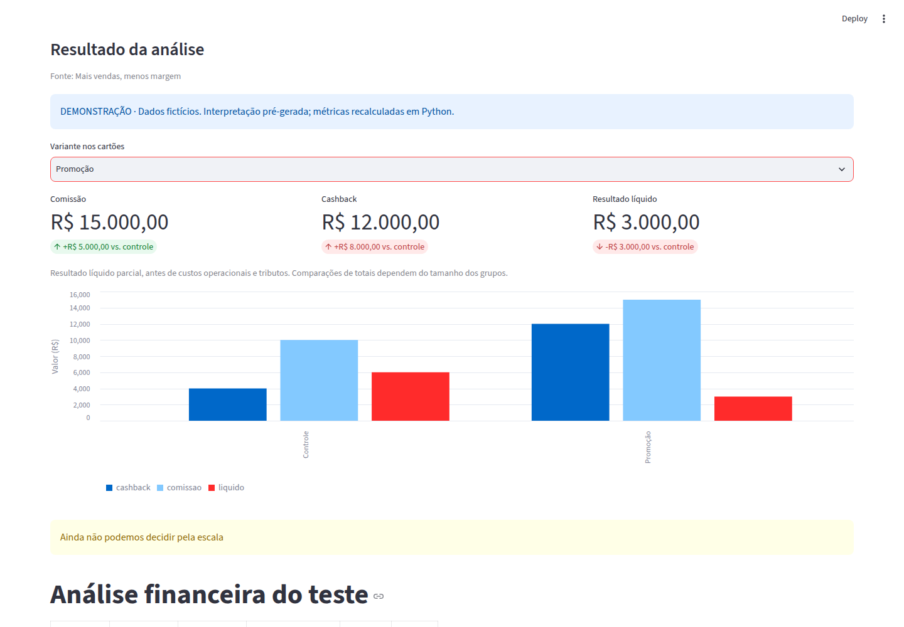

# ROIBeacon: decisões de cashback com dados

**Estudo de caso de engenharia de dados, experimentação e IA aplicada a Growth.**

O ROIBeacon compara variantes de cashback e mostra quando os dados ainda não sustentam uma decisão. Os números são calculados em Python; a IA é uma camada opcional de interpretação.

**[Acessar o aplicativo e experimentar](https://roibeacon.streamlit.app/)**

Escolha um cenário e clique em **Experimentar com dados de exemplo** para explorar a demonstração sem configurar credenciais.

## Problema

Uma promoção pode aumentar vendas e, ao mesmo tempo, reduzir o resultado financeiro. Comparar apenas faturamento ou delegar cálculos a um modelo de linguagem pode esconder esse efeito. O projeto reúne métricas explícitas, validação dos dados e limitações estatísticas em uma interface para apoiar a análise.

## Demonstração sem credenciais

Teste diretamente no [aplicativo publicado](https://roibeacon.streamlit.app/) ou execute localmente:

```bash
python -m venv venv
source venv/bin/activate  # Windows: venv\Scripts\activate
pip install -r requirements.txt
streamlit run app.py
```

Abra `http://localhost:8501`, escolha um cenário e clique em **Experimentar com dados de exemplo**. Não é necessário configurar Groq nem Google Sheets.

| Cenário fictício | Resultado líquido: controle → variante | O que observar |
|---|---:|---|
| Variante com resultado melhor | R$ 6.000 → R$ 9.500 | Ganho observado não basta para autorizar escala |
| Mais vendas, menos margem | R$ 6.000 → R$ 3.000 | Vendas sobem 50%, mas a margem cai de 6% para 2% |
| Teste inconclusivo | R$ 24 → R$ 29 | Apenas 40 e 42 usuários; faltam evidências |

A interface identifica a **interpretação pré-gerada**. Os cartões e relatórios são calculados novamente a partir dos CSVs fictícios em `examples/`. O relatório pode ser baixado em Markdown. O simulador permite variar comissão e cashback sem assumir que incentivos aumentam conversão.

[Assistir à demonstração completa (vídeo curto)](assets/decisao_cashback.mp4)



O vídeo mostra o cenário fictício de promoção, os cartões e o gráfico, a conclusão sem escala automática, a simulação e o download do relatório. Foi gravado na aplicação local; não utiliza chamadas externas.

## Decisões técnicas

- **Cálculos independentes da IA:** `analytics.py` valida entradas, usa `Decimal` para valores monetários e calcula margem e ROI. A camada de IA recebe métricas prontas.
- **Estado da análise:** cartões, gráfico, relatório e simulador permanecem disponíveis entre interações, usando o estado da sessão Streamlit.
- **Integrações opcionais:** Groq e Sheets só são chamados ao clicar nos respectivos botões. Falhas externas não apagam os resultados locais. A gravação usa `RAW` para não interpretar fórmulas.
- **Validação explícita:** valores inválidos nunca viram zero. Grupos repetidos são rejeitados, em vez de somar indiscriminadamente taxas, identificadores ou usuários possivelmente sobrepostos.
- **Decisão conservadora:** não há exigência de escolher um vencedor. Uma diferença de conversão não comprova ganho financeiro.

Stack: Python 3.10+, Pandas, Streamlit, Groq (`openai/gpt-oss-120b`), gspread e Google Auth.

## Contrato dos dados e métricas

Envie um CSV UTF-8, separado por vírgula ou ponto e vírgula, com **uma linha por variante**, para o mesmo período. A primeira linha é o controle. Limites: 2 MB, 20 variantes e valores monetários até R$ 1 trilhão. Números decimais aceitos: `1234.56`, `1234,56` e `R$ 1.234,56` (coloque entre aspas quando houver vírgula no delimitador). Valores como `1.234` sem indicação de moeda são rejeitados por ambiguidade.

| Coluna | Significado |
|---|---|
| `grupo` | Nome único da variante; também aceita `variante` ou `Grupos de usuários` |
| `vendas` | Valor bruto das compras, equivalente ao GMV; aliases: `vendas totais`, `faturamento` |
| `comissao` | Receita bruta da plataforma recebida dos parceiros; também aceita `comissão` |
| `cashback` | Custo do benefício financiado pela plataforma |
| `usuarios` (opcional) | Usuários únicos expostos à variante, incluindo quem não comprou |
| `compradores` (opcional) | Usuários únicos que compraram; não é quantidade de pedidos |

A palavra **receita** pode significar coisas diferentes em fontes distintas. Uma coluna chamada `receita` não é mapeada automaticamente: renomeie para `comissao` somente se representar a remuneração da plataforma, ou para `vendas` se representar o valor bruto vendido. Colunas extras são ignoradas.

| Métrica | Fórmula / unidade |
|---|---|
| Resultado líquido parcial | comissão − cashback, em R$ |
| Margem sobre vendas | resultado líquido / vendas, em % |
| ROI do cashback | resultado líquido / cashback, em %; indefinido quando cashback = 0 |
| Resultado por usuário | resultado líquido / usuários expostos, quando disponível |
| Conversão | compradores únicos / usuários expostos |

O resultado líquido não inclui custos operacionais, impostos, fraudes, cancelamentos ou valor futuro do cliente. Não representa lucro contábil. A comissão não pode exceder vendas; cashback pode superar comissão e produzir prejuízo.

## Incerteza e conclusão

Quando há usuários e compradores, calculamos intervalos de Wilson de 95% para conversão por grupo. Para exatamente duas variantes, mostramos também um intervalo normal aproximado de 95% para a diferença de conversão, desde que cada grupo tenha pelo menos 100 usuários e 5 compradores e 5 não compradores. Esse mínimo é uma regra operacional do protótipo, **não um cálculo de poder estatístico**.

São sinalizados dados ausentes, amostras pequenas e desequilíbrio de tamanho (menor grupo abaixo de 80% do maior). O desequilíbrio é um alerta descritivo; sem proporção planejada de alocação, não é um teste formal de sample ratio mismatch.

Hipóteses: usuários independentes, grupos exclusivos e um indicador de compra por usuário. Não há correção para múltiplas comparações ou consultas repetidas ao teste. Referências: [Wilson no NIST](https://www.itl.nist.gov/div898/handbook/prc/section2/prc241.htm) e [intervalo para diferença de proporções no NIST](https://www.itl.nist.gov/div898/software/dataplot/refman1/auxillar/diffprop.htm).

O contrato agregado atual não contém variância financeira por usuário nem comprova randomização e duração adequada. Por isso o sistema **não autoriza escala automaticamente**, mesmo no exemplo com melhor resultado observado. O relatório explica quais informações faltam.

## Simulador

A projeção mantém o volume de vendas informado constante:

```text
comissão projetada = vendas × taxa de comissão / 100
cashback projetado = vendas × taxa de cashback / 100
resultado projetado = comissão projetada − cashback projetado
```

As duas taxas incidem sobre vendas. A simulação não estima causalidade, elasticidade, conversão ou comportamento futuro. A comparação exibida é com o valor observado da variante selecionada.

## Integrações opcionais

Para usar a explicação por IA, copie `.env.example` para `.env` e preencha `GROQ_API_KEY` com uma chave da [Groq](https://console.groq.com/keys). A chave continua sendo da Groq, embora o modelo se chame `openai/gpt-oss-120b`.

Para salvar no Sheets, preencha também `GOOGLE_SHEETS_ID` (trecho entre `/d/` e `/edit` da URL da planilha). Habilite a API do Google Sheets e compartilhe apenas a planilha de destino com o e-mail da Service Account, como editor. Crie `.streamlit/secrets.toml` com os dados do JSON dessa conta:

```toml
[gcp_service_account]
type = "service_account"
project_id = "seu-projeto"
private_key_id = "id_da_chave"
private_key = "CHAVE_PRIVADA_DO_JSON_COM_ESCAPES_DE_NOVA_LINHA"
client_email = "conta@seu-projeto.iam.gserviceaccount.com"
client_id = "id_do_cliente"
token_uri = "https://oauth2.googleapis.com/token"
```

Preserve os escapes `\n` da chave privada. Na hospedagem Streamlit, configure `GROQ_API_KEY` e `GOOGLE_SHEETS_ID` no nível principal dos Secrets, **antes** de `[gcp_service_account]`. Ambiente tem precedência; `.env` preenche variáveis ainda não definidas; Secrets são o fallback. Reinicie após alterar credenciais. Configure `app.py` como arquivo de entrada.

`.env`, `.streamlit/` e arquivos da IDE são ignorados pelo Git. A demonstração funciona mesmo sem esses arquivos. Ao solicitar IA, métricas agregadas, nomes de grupos e diretriz são enviados à Groq; ao salvar, o relatório é enviado ao Google. Não use dados pessoais no protótipo. Não há autenticação nem quotas por usuário: uma implantação pública com chaves exige controle de acesso e limites de consumo.

### Diagnóstico de falhas na hospedagem

- **Groq recusa autenticação:** atualize `GROQ_API_KEY` nos Secrets do site e reinicie. Alterar o `.env` local não atualiza a hospedagem.
- **Limite de uso:** aguarde e confira a quota no provedor indicado na mensagem.
- **Planilha não encontrada ou acesso negado:** confira `GOOGLE_SHEETS_ID`, habilite a API do Sheets e compartilhe a planilha com a Service Account como editor.
- **Credenciais do Google inválidas:** revise a seção `gcp_service_account`, preservando a chave privada completa e `token_uri`.
- **CSV inválido:** confira as colunas e os formatos descritos no contrato de dados. Um relatório textual não substitui uma tabela de métricas.

As mensagens identificam a etapa sem expor o corpo dos erros das APIs. Falhas da IA ou do Sheets preservam a análise local e o download. Se o site ainda exibir uma interface diferente desta documentação, confira a branch e o arquivo de entrada do deploy e publique o commit atual.

## Verificação e limitações

```bash
python -m unittest discover -s tests -v
```

Os testes cobrem formatos monetários, dados inválidos, fórmulas, cashback zero, cenários esperados, intervalos, simulação e fluxos da interface via [Streamlit AppTest](https://docs.streamlit.io/develop/api-reference/app-testing/st.testing.v1.apptest). Integrações são simuladas nos testes, sem uso de credenciais nem chamadas pagas.

Não foi medida economia de tempo ou melhoria de precisão. Para medir tempo, o próximo estudo deve comparar a mesma tarefa manual e no aplicativo, com datasets equivalentes, registrar duração e erros e publicar tamanho da amostra e resultados. Para precisão, a referência deve ser uma planilha de cálculo revisada, independente da IA.

Próximos passos: dados por usuário para estimar incerteza financeira, planejamento de amostra e duração, validação de alocação, autenticação e limites de uso, persistência com idempotência para evitar duplicação em tentativas de gravação. A IA pode produzir interpretações incorretas e deve ser revisada.

## Estrutura

```text
app.py             # Interface e estado da sessão
analytics.py       # Validação, métricas, incerteza e simulação
scenarios.py       # Cenários e interpretações pré-geradas
integrations.py    # Groq e Google Sheets opcionais
examples/          # Três CSVs fictícios
tests/             # Testes dos cálculos e da interface
assets/            # Vídeo e captura da interface atual
.env.example       # Configuração opcional, sem credenciais reais
```

Desenvolvido por Iuri Paiva.
